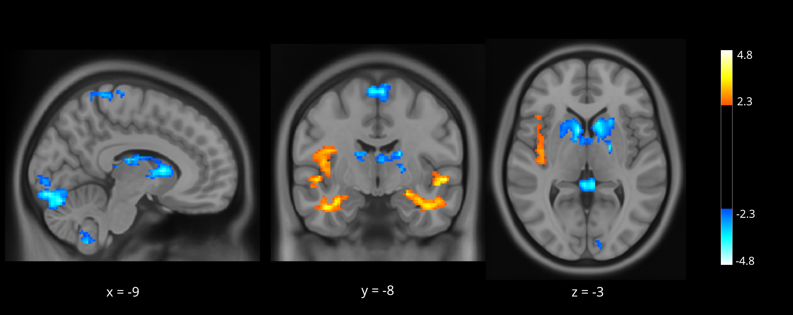

## plot_stat_map
> script to plot fMRI statistical maps: saves high resolution PNG images for every x y z slice + a thresholded colorbar  

[nilearn function: plot_stat_map](https://nilearn.github.io/modules/generated/nilearn.plotting.plot_stat_map.html#nilearn.plotting.plot_stat_map)  

**to run**:
- `$ python3 < path to plot_stat_map.py >`  
- enter lower and upper bound for colormap: `vmin` `vmax`  
- should activation outside brain (MNI152) be masked: `y/n`
- select stats and background NIFTI files, then name output `directory/file`
